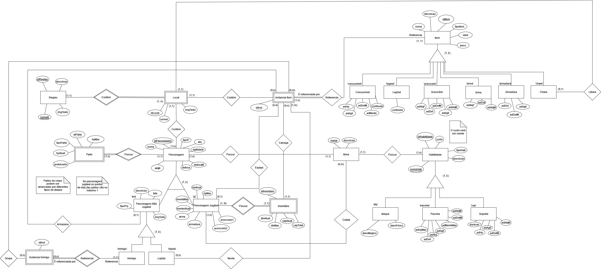
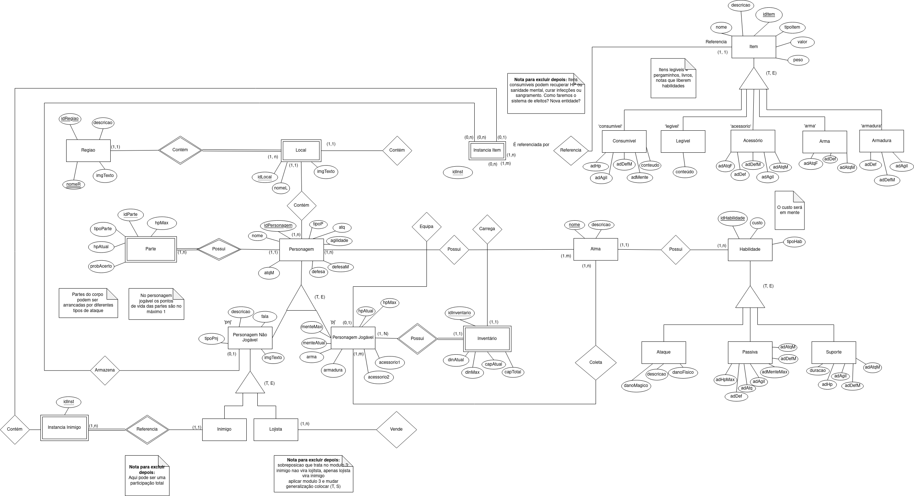
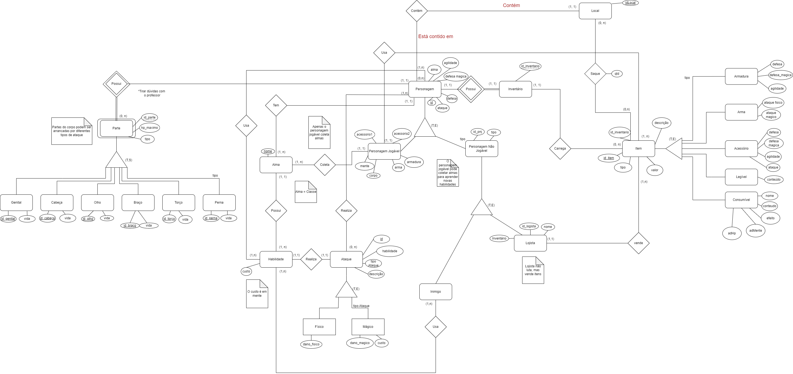

# DER

### Versionamento

| Versão | Data       | Modificação                                                                              | Autor                               |
| ------ | ---------- | ---------------------------------------------------------------------------------------- | ----------------------------------- |
| 0.1    | 16/09/2023 | Criação do Documento                                                                     | Pedro Lima                          |
| 0.2    | 24/09/2023 | Adição da versão 1.0 do DER                                                              | Pedro, Matheus, Alexandre, Gabriela |
| 0.3    | 02/10/2023 | Adição da versão 1.1 do DER                                                              | Pedro, Matheus, Alexandre, Gabriela |
| 0.4    | 02/10/2023 | Adição da versão 1.2 do DER                                                              | Pedro, Matheus, Alexandre, Gabriela |
| 0.5    | 30/10/2023 | Adição da versão 1.3 do DER                                                              | Matheus, Gabriela                   |
| 0.6    | 15/11/2023 | Adição da versão 2.0 do DER conforme feedback                                            | Matheus, Gabriela                   |
| 0.7    | 15/11/2023 | Adição da versão 2.1 do DER                                                              | Matheus, Gabriela                   |
| 0.8    | 28/11/2023 | Adição da versão 2.2 do DER, correções no versionamento e adições das versões anteriores | Gabriela                            |
| 0.9    | 02/12/2023 | Adição da versão 2.3 do DER | Gabriela e Matheus|

## O que é?

Um DER, ou Diagrama de Entidade-Relacionamento, é uma ferramenta gráfica utilizada para representar a estrutura e as relações entre diferentes entidades em um sistema de banco de dados. Ele é uma representação visual que mostra como as entidades estão interconectadas e como os dados são organizados e relacionados em um banco de dados.

Em suma, um Diagrama de Entidade-Relacionamento é uma ferramenta essencial no processo de design e modelagem de banco de dados, contribuindo para a organização eficaz e a integridade dos dados em um sistema.

### Desenvolvimento do Diagrama Entidade-Relacionamento

Durante a disciplina foram geradas várias versões do diagrama entidade-relacionamento, para atender regras de negócio propostas pela equipe e realizar alterações que garantissem a correção dos diagramas conforme o estudo na disciplina e os feedbacks do professor. As versões podem ser acompanhadas logo abaixo.

Clique para apresentar a versão 2.3 do DER

### DER v2.3

Documentar alteracoes aqui.

Clique para apresentar a versão 2.2 do DER

### DER v2.2

Documentar alteracoes aqui.

Clique para apresentar a versão 2.1 do DER

### DER v2.1

Documentar alteracoes aqui.

Clique para apresentar a versão 2.0 do DER

### DER v2.0

Documentar alteracoes aqui.

Clique para apresentar a versão 1.3 do DER

### DER v1.3

Documentar alteracoes aqui.

Clique para apresentar a versão 1.2 do DER

### DER v1.2

Documentar alteracoes aqui.

Clique para apresentar a versão 1.1 do DER

### DER v1.1

Documentar alteracoes aqui.

Clique para apresentar a versão 1.0 do DER

### DER v1.0

Documentar alteracoes aqui.

