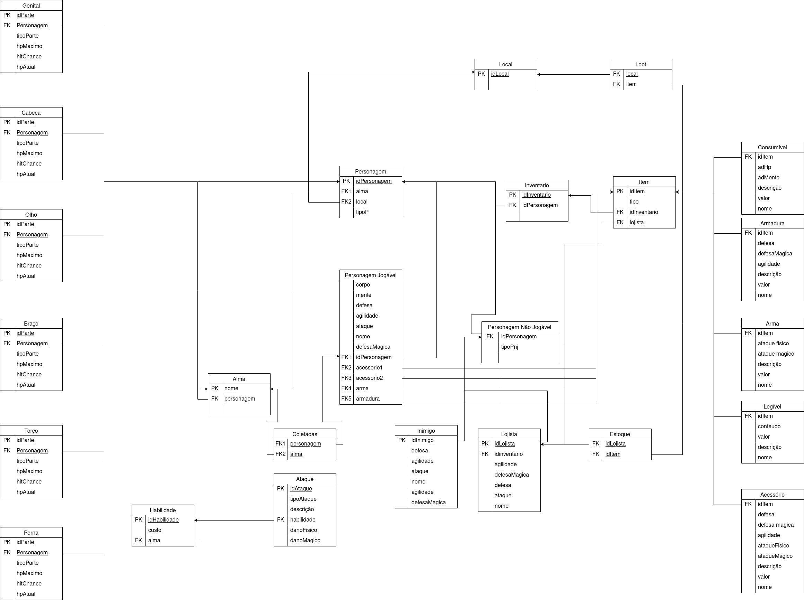

# MREL

### Versionamento

| Versão | Data       | Modificação                 | Autor                               | Revisor(es) |
| ------ | ---------- | --------------------------- | ----------------------------------- | ----------- |
| 1.0    | 16/09/2023 | Criação do Documento        | Pedro Lima                          | -           |
| 1.1    | 01/09/2023 | Criação do modelo relaciona | Pedro, Matheus, Alexandre, Gabriela | -           |
| 1.2    | 02/09/2023 | Criação do modelo relaciona | Pedro, Matheus, Alexandre, Gabriela | -           |
| 1.3    | 30/10/2023 | Atualizando atributos, corrigindo generalizações | Matheus, Gabriela | -           |

## O que é? 

O Modelo Relacional é um modelo de dados amplamente utilizado para organizar e representar informações em bancos de dados. Ele foi proposto por Edgar F. Codd, um matemático e cientista da computação, em 1970.

Este modelo organiza os dados em tabelas bidimensionais chamadas de "relações". Cada relação consiste em uma coleção de tuplas, onde cada tupla representa uma entidade específica e cada coluna na tabela representa um atributo daquela entidade.

