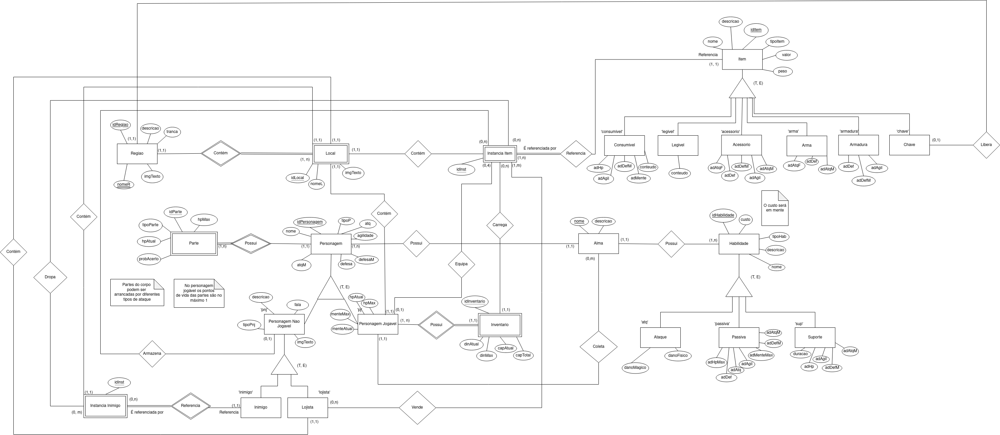

# DER

### Versionamento

| Versão | Data       | Modificação                 | Autor                               | Revisor(es) |
| ------ | ---------- | --------------------------- | ----------------------------------- | ----------- |
| 1.0    | 16/09/2023 | Criação do Documento        | Pedro Lima                          | -           |
| 1.1    | 24/09/2023 | Criação do modelo de tabela | Pedro, Matheus, Alexandre, Gabriela | -           |
| 1.2    | 01/09/2023 | Atualização do DER          | Pedro, Matheus, Alexandre, Gabriela | -           |
| 1.3    | 30/10/2023 | Removendo atributos, pequenos ajustes          | Matheus, Gabriela | -           |

## O que é?

Um DER, ou Diagrama de Entidade-Relacionamento, é uma ferramenta gráfica utilizada para representar a estrutura e as relações entre diferentes entidades em um sistema de banco de dados. Ele é uma representação visual que mostra como as entidades estão interconectadas e como os dados são organizados e relacionados em um banco de dados.

Em suma, um Diagrama de Entidade-Relacionamento é uma ferramenta essencial no processo de design e modelagem de banco de dados, contribuindo para a organização eficaz e a integridade dos dados em um sistema.

